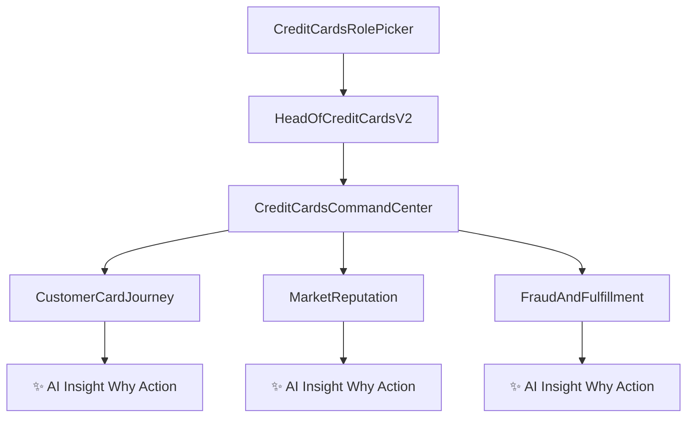

# Head of Credit Cards Redesign (Credit-Card Specific) Plan

## What Changes in This Revision
This redesign is **credit-card domain specific**, not a retail clone. The structure remains low-click, but all drill components are redefined for credit cards (lifecycle, disputes, fraud, spend behavior, delinquency risk, rewards, and service operations).

## Product Framing (From Transcript)
- Position for CEO/COO as a **CX Promise Command Center**.
- Measure whether customer promise is being met through:
  - Channel sentiment + effort + ownership quality.
  - Resolution performance (fastest/avg/slowest by top intents/processes).
  - Workforce efficiency (throughput adjusted for complexity).
  - External public perception (social/influencer/review signals).
- Surface one transparent weighted score at top, but drive decisions through **drill components**, not just aggregates.

## UX Flow (Strict 2-Level)
- **Level 1 (Command Center):** three clickable pillars only:
  - Customer Happiness
  - Brand & Reputation Risk
  - Service Fulfillment
- **Level 2 (Pillar Drill View):** one dedicated page per pillar, no further nesting.
- Keep low-click behavior aligned with Head of Retail usability.
- Each drill page uses a strict **3-column layout** with **6-7 components** total.

## Screen-by-Screen Component Blueprint

### Level 1: Credit Cards Command Center
Build a new page that combines high-level context + actionable entry points.

Components to include:
- `CreditCardsCommandHeader`
  - CX Promise status, timeframe, persona context.
- `CreditCardsHealthScoreBreakdown`
  - Weighted formula display (channel + process + risk + external mix).
  - “Why this moved” explainer panel.
- `CreditCardsPillarCards` (3 clickable cards)
  - Each card shows current score, trend, key risk, and one `✨ AI Insight`.
- `CreditCardsChannelPulseStrip`
  - Email, Voice, Chat, Social, Tickets mini cards with sentiment + volume + backlog.
- `CreditCardsExternalVsInternalLens`
  - Split panel: market signal vs operational delivery.
- `CreditCardsPriorityQueue`
  - Top 5 “act now” intents/processes with owner/channel cues.
- `✨ AI Command Brief`
  - Auto-generated executive briefing: what changed, why, where to intervene.

### Level 2A: Customer Card Journey
Credit-card-specific focus: onboarding, transaction declines, rewards redemption, statement clarity, dispute handling, card replacement journeys.

3-column layout with 7 components:
- **Column 1 (Customer Experience):**
  - `CardJourneySatisfactionRail` (Apply->Activate->Use->Redeem->Support by channel).
  - `DeclineAndDisputeExperiencePanel` (friction on declined transactions/disputes).
- **Column 2 (Operations & Channel):**
  - `ChannelEffortAndSentimentHeatmap` (Email/Voice/Chat/Social/Tickets).
  - `RewardsAndBillingConfusionDrivers` (top pain intents causing low happiness).
- **Column 3 (AI Decision):**
  - `✨ AI RootCauseNarrative` (journey + channel + intent causal chain).
  - `✨ AI NextBestActions` (playbook by channel/team with expected uplift).
  - `PromiseBreachMomentsTimeline` (AI-highlighted drop points and likely triggers).

### Level 2B: Market Reputation
Credit-card-specific focus: card product reputation, social virality around fees/declines, comparison-site ranking, influencer sentiment.

3-column layout with 7 components:
- **Column 1 (External Market):**
  - `CardBrandPerceptionScoreboard` (core cards/co-brands comparison).
  - `CreditCardReviewSiteRankingPanel` (top comparison portals, ranking trend).
- **Column 2 (Public Signal Intelligence):**
  - `SocialViralityAndHashtagMomentum` (fee shock, reward devaluation, outage chatter).
  - `InfluencerAndAnalystWatchlist` (recommendation stance and reach impact).
- **Column 3 (AI Decision):**
  - `ReputationToOpsFailureLinkage` (maps external negativity to internal process gaps).
  - `✨ AI ReputationEarlyWarning` (predicted spike by channel and brand line).
  - `✨ AI NarrativeControlActions` (proactive narrative + service actions).

### Level 2C: Fraud and Fulfillment
Credit-card-specific focus: dispute resolution SLAs, fraud case handling, limit increase processing, charge reversal turnaround, replacement card dispatch.

3-column layout with 7 components:
- **Column 1 (Process Fulfillment):**
  - `IntentResolutionVelocityBoard` (fastest/avg/slowest by card intents/processes).
  - `DisputeAndFraudCaseLifecycleTracker` (open->investigate->resolve funnel health).
- **Column 2 (Team Efficiency):**
  - `SLAAndBacklogPressureMatrix` (channel x intent x severity).
  - `ThroughputVsComplexityWorkforceLens` (team throughput normalized by case complexity).
- **Column 3 (AI Decision):**
  - `EscalationAndReopenRiskGrid` (where fulfillment promise likely to break).
  - `✨ AI FulfillmentOptimizer` (routing/staffing/process levers).
  - `✨ AI WhatIfSimulator` (projected promise score impact in 7/14/30 days).

## Channel-Integrated Data Contract (Mandatory)
Use channels as first-class dimensions in all major widgets:
- Email
- Voice
- Chat
- Social
- Tickets

Add explicit data models for:
- Channel sentiment and effort vectors.
- Intent/process resolution latency distributions.
- Throughput and complexity-adjusted productivity.
- External reputation signals and rankings.
- AI-derived insights, confidence, and suggested actions.

## File-Level Implementation Plan
- Add new parallel dashboard and drill screens:
  - [`D:/office/clariverse-ui/frontend/components/role-based-dashboard/HeadOfCreditCardsDashboard.tsx`](D:/office/clariverse-ui/frontend/components/role-based-dashboard/HeadOfCreditCardsDashboard.tsx)
  - [`D:/office/clariverse-ui/frontend/components/role-based-dashboard/CreditCardsDrillDownScreens.tsx`](D:/office/clariverse-ui/frontend/components/role-based-dashboard/CreditCardsDrillDownScreens.tsx)
- Add credit-card-specific mock/domain data:
  - [`D:/office/clariverse-ui/frontend/lib/role-based-dashboard/creditCardsData.ts`](D:/office/clariverse-ui/frontend/lib/role-based-dashboard/creditCardsData.ts)
- Add new role for parallel rollout (existing remains untouched):
  - [`D:/office/clariverse-ui/frontend/lib/role-based-dashboard/registry.tsx`](D:/office/clariverse-ui/frontend/lib/role-based-dashboard/registry.tsx)
- Route new role to redesigned component, preserve old role routing:
  - [`D:/office/clariverse-ui/frontend/components/role-based-dashboard/RoleDashboardView.tsx`](D:/office/clariverse-ui/frontend/components/role-based-dashboard/RoleDashboardView.tsx)

## AI Flavor Standard (Hard Requirement)
- Every major section includes at least one card with visible `✨` prefix.
- Standard card trio in each screen:
  - `✨ AI Insight`
  - `✨ AI Why`
  - `✨ AI Action`
- Avoid purely descriptive analytics blocks without AI guidance context.

## Visual/Behavior Alignment with Head of Retail
- Match retail readability, card spacing, and executive scannability.
- Keep concise, high-density but low-clutter composition.
- Preserve “click card -> drill page” interaction style.
- No deep navigation trees beyond 2 levels.
- Enforce 3-column drill layouts with balanced information density per column.

## Validation Checklist
- New parallel role is visible and launches redesigned dashboard.
- Existing Head of Credit Cards route remains unchanged.
- All 3 pillar cards open correct drill views.
- No drill path exceeds 2 levels.
- Email/Voice/Chat/Social/Tickets appear across all pillar drills.
- `✨` AI blocks present on command center and every drill page.
- Lint/type checks pass for changed files.

## Flow Diagram

## Deliverables
- Full retail-style Head of Credit Cards V2 experience.
- Rich componentized storytelling across all three pillars.
- Channel-integrated decision layer for internal + external promise measurement.
- Consistent AI-driven narrative presence (`✨`) across every screen.